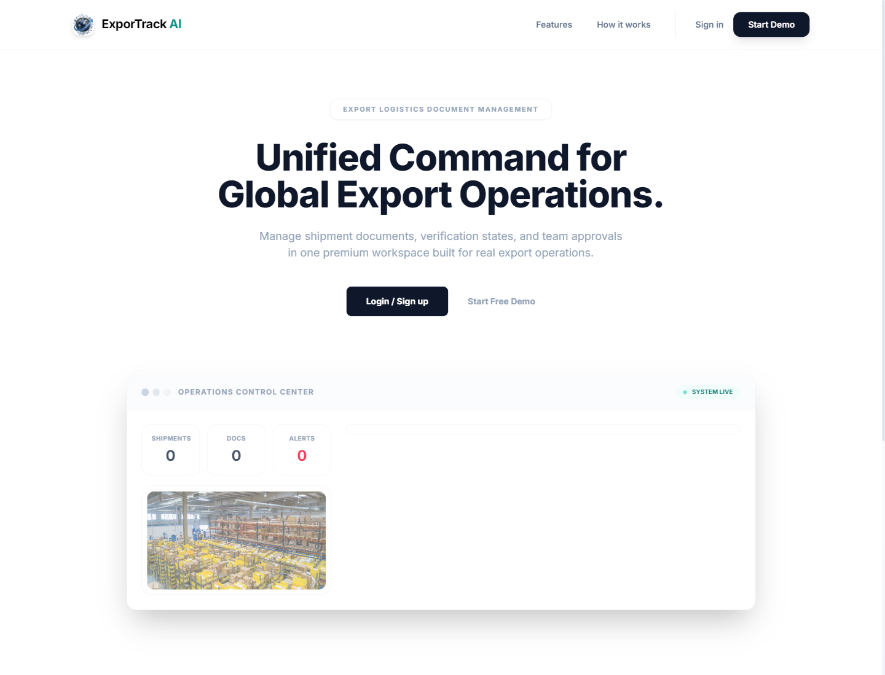
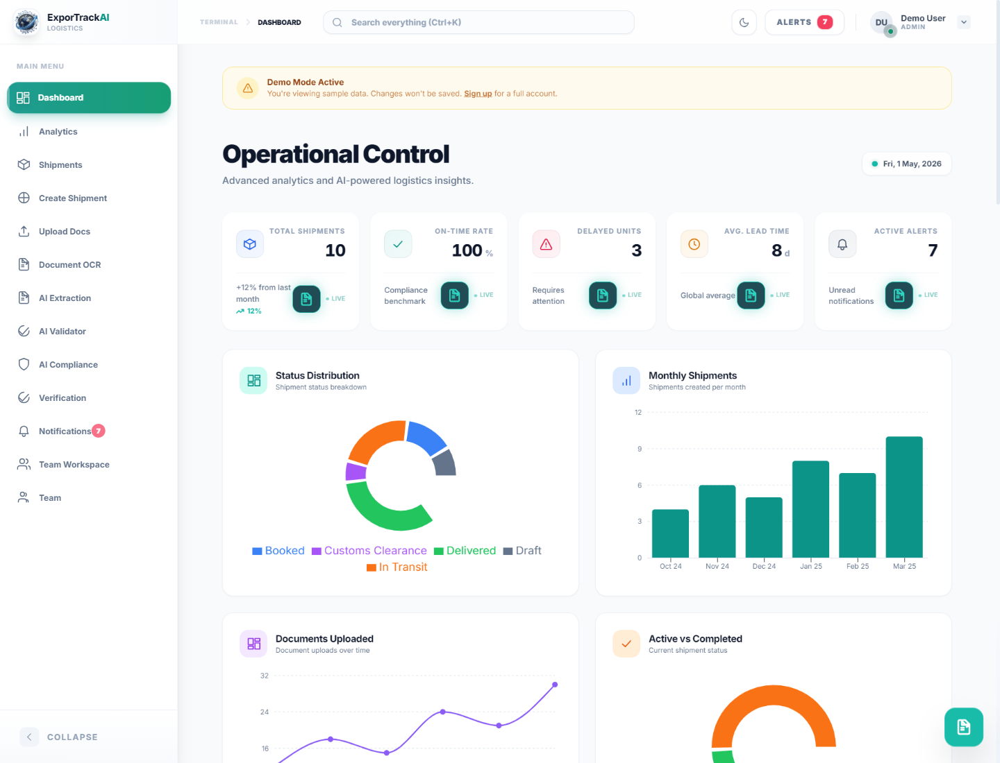
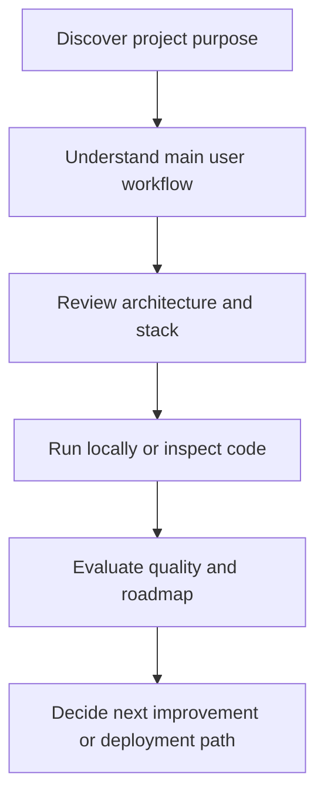
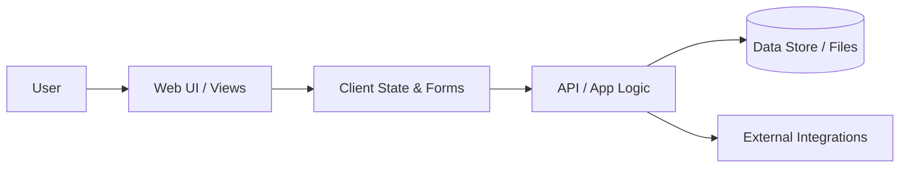
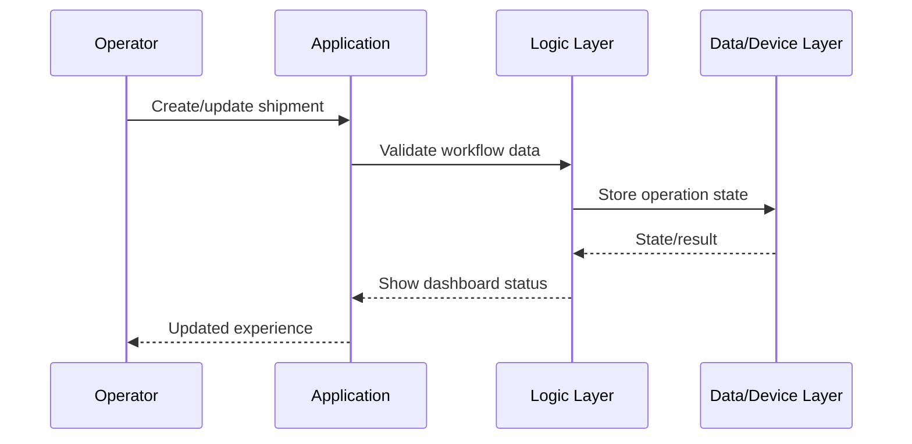

<div align="center">

# ExporTrack AI

### Full-stack export logistics workflow platform with shipment tracking, document verification, and operational dashboards.


**Repository:** [bhedanikhilkumar-code/ExporTrack-AI](https://github.com/bhedanikhilkumar-code/ExporTrack-AI)

<!-- REPO_HEALTH_BADGE_START -->
[](https://github.com/bhedanikhilkumar-code/ExporTrack-AI/actions/workflows/repository-health.yml)
<!-- REPO_HEALTH_BADGE_END -->

</div>

---

## Executive Overview

ExporTrack AI is a full-stack export logistics workspace for managing shipment operations, document verification, buyer/supplier coordination, public tracking, and analytics from one dashboard.

The project is positioned as a **portfolio-grade operations platform**: it shows product thinking, a realistic multi-role workflow, a polished React/TypeScript interface, backend API structure, and documentation that helps a recruiter or reviewer understand the system quickly.

## Recruiter Quick Scan

| What to notice | Why it matters |
| --- | --- |
| **Real business workflow** | Shipment creation, document upload, verification checklists, tracking, notifications, and client portal flows. |
| **Full-stack scope** | React/Vite frontend, Express/MySQL backend APIs, typed UI components, and structured data workflows. |
| **Product polish** | Dashboard KPIs, charts, shipment timeline, tracking map, PWA-style UX, and mobile-aware navigation. |
| **AI/product angle** | AI document extraction, validation, compliance copilot, delay prediction, and OCR-oriented screens. |
| **Recruiter signal** | Demonstrates the ability to turn an operational problem into a usable product, not just a small tutorial app. |

## Demo Preview

| Landing / product entry | Operations dashboard |
| --- | --- |
|  |  |

> Screenshots are captured from the local running frontend demo so visitors can understand the product experience before cloning the repository.

## Product Positioning

| Question | Answer |
| --- | --- |
| **Who is it for?** | Export businesses, operations teams, logistics coordinators, buyers, and reviewers evaluating a realistic workflow product. |
| **What problem does it solve?** | Export operations often scatter shipment data, verification status, documents, tracking, and team communication across multiple tools. ExporTrack AI brings those flows into one command center. |
| **Why it matters?** | It demonstrates practical full-stack engineering: workflow modeling, dashboards, document handling, authentication-style flows, API boundaries, analytics, and UI polish. |
| **Current focus** | Stronger demo presentation, production deployment readiness, API hardening, and more automated verification around shipment/document workflows. |

## Repository Snapshot

| Area | Details |
| --- | --- |
| Visibility | Public portfolio repository |
| Primary stack | `React`, `TypeScript`, `Vite`, `Tailwind CSS`, `Express`, `MySQL` |
| Product areas | Shipments, documents, verification, analytics, tracking, buyers, suppliers, client portal, AI-assist screens |
| Useful commands | Frontend: `npm run dev`, `npm run build`; Backend: `npm start` |
| Key dependencies | `react`, `react-router-dom`, `recharts`, `leaflet`, `jspdf`, `express`, `mysql2` |

## Topics

`dashboard` · `express` · `logistics` · `react` · `supply-chain` · `typescript`

## Key Capabilities

| Capability | Description |
| --- | --- |
| **Shipment command center** | Create and inspect shipments, track progress, review statuses, and surface operational alerts. |
| **Document workflow** | Upload, organize, verify, and generate export documents such as invoices, packing lists, shipping bills, and certificates of origin. |
| **Analytics and visibility** | Dashboard KPIs, charts, report export, shipment analytics, and delay/risk-oriented components. |
| **Tracking experience** | Internal and public tracking pages, timeline views, map-based tracking components, and client-facing shipment views. |
| **Team and role structure** | Team workspace, admin/profile pages, permission-aware UI hooks, client portal, buyers, and suppliers. |
| **AI-assisted surfaces** | Document extraction, validator, compliance copilot, OCR page, scan results, and delay prediction components. |

<!-- PROJECT_DOCS_HUB_START -->

## Documentation Hub

| Document | Purpose |
| --- | --- |
| [Architecture](docs/ARCHITECTURE.md) | System layers, workflow, data/state model, and extension points. |
| [Case Study](docs/CASE_STUDY.md) | Product framing, decisions, tradeoffs, and portfolio story. |
| [Roadmap](docs/ROADMAP.md) | Practical next steps for turning the project into a stronger product. |
| [Quality Standard](docs/QUALITY.md) | Repository health checks, review standards, and quality gates. |
| [Review Checklist](docs/REVIEW_CHECKLIST.md) | Final share/recruiter review checklist for a stronger GitHub impression. |
| [Contributing](CONTRIBUTING.md) | Branching, commit, review, and quality guidelines. |
| [Security](SECURITY.md) | Responsible disclosure and safe configuration notes. |
| [Support](SUPPORT.md) | How to ask for help or report issues clearly. |
| [Code of Conduct](CODE_OF_CONDUCT.md) | Collaboration expectations for respectful project activity. |

<!-- PROJECT_DOCS_HUB_END -->

## Detailed Product Blueprint

### Experience Map



### Feature Depth Matrix

| Layer | What reviewers should look for | Why it matters |
| --- | --- | --- |
| Product | Clear user problem, target audience, and workflow | Shows product thinking beyond tutorial-level code |
| Interface | Screens, pages, commands, or hardware interaction points | Demonstrates how users actually experience the project |
| Logic | Validation, state transitions, service methods, processing flow | Proves the project can handle real use cases |
| Data | Local storage, database, files, APIs, or device input/output | Explains how information moves through the system |
| Quality | Tests, linting, setup clarity, and roadmap | Makes the project easier to trust, extend, and review |

### Conceptual Data / State Model

| Entity / State | Purpose | Example fields or responsibilities |
| --- | --- | --- |
| User input | Starts the main workflow | Form values, commands, uploaded files, device readings |
| Domain model | Represents the project-specific object | Transaction, note, shipment, event, avatar, prediction, song, or task |
| Service layer | Applies rules and coordinates actions | Validation, scoring, formatting, persistence, API calls |
| Storage/output | Keeps or presents the result | Database row, local cache, generated file, chart, dashboard, or device action |
| Feedback loop | Helps improve the next interaction | Status message, analytics, error handling, recommendations, roadmap item |

### Professional Differentiators

- **Documentation-first presentation:** A reviewer can understand the project without guessing the intent.
- **Diagram-backed explanation:** Architecture and workflow diagrams make the system easier to evaluate quickly.
- **Real-world framing:** The README describes users, outcomes, and operational flow rather than only listing files.
- **Extension-ready roadmap:** Future improvements are scoped so the project can keep growing cleanly.
- **Portfolio alignment:** The project is positioned as part of a consistent, professional GitHub portfolio.

## Architecture Overview



## Core Workflow



## How the Project is Organized

```text
ExporTrack-AI/
├── 📁 frontend
│   ├── 📁 public
│   ├── 📁 src
│   ├── 📄 capacitor.config.ts
│   ├── 📄 favicon.svg
│   ├── 📄 index.html
│   ├── 📄 package-lock.json
│   └── 📄 package.json
├── 📁 backend
│   ├── 📁 api
│   ├── 📁 server
│   ├── 📄 package-lock.json
│   ├── 📄 package.json
│   └── 📄 server.js
├── 📄 Dockerfile
├── 📄 package-lock.json
├── 📄 push-to-github.bat
├── 📄 push-to-github.ps1
├── 📄 schema.sql
├── 📄 SENDGRID_SETUP_GUIDE.md
├── 📄 tsc_output_2.txt
├── 📄 vercel.json
```

## Engineering Notes

- **Separation of concerns:** UI, business logic, data/services, and platform concerns are documented as separate layers.
- **Scalability mindset:** The project structure is ready for new screens, services, tests, and deployment improvements.
- **Portfolio quality:** README content is designed to communicate value before someone even opens the code.
- **Maintainability:** Naming, setup steps, and roadmap items make future work easier to plan and review.
- **User-first framing:** Features are described by the value they provide, not just the technology used.

## Local Setup

```bash
# Clone the repository
git clone <repo-url>
cd <repo-name>

# Follow the stack-specific setup notes in the source files.
```

## Suggested Quality Checks

Before shipping or presenting this project, run the checks that match the stack:

| Check | Purpose |
| --- | --- |
| Format/lint | Keep code style consistent and reviewer-friendly. |
| Static analysis | Catch type, syntax, and framework-level issues early. |
| Unit/widget tests | Validate important logic and user-facing workflows. |
| Manual smoke test | Confirm the main flow works from start to finish. |
| README review | Ensure documentation matches the actual repository state. |

## Roadmap

- Role-based dashboards
- Shipment event timeline
- Document audit trail
- Advanced analytics and exception alerts

## Professional Review Checklist

- [x] Clear project purpose and audience
- [x] Feature list aligned with real user workflows
- [x] Architecture documented with diagrams
- [x] Screenshots added for quick recruiter review
- [ ] Setup steps tested on a clean machine
- [ ] Environment variables documented without exposing secrets
- [ ] Tests/lint commands documented
- [ ] Roadmap shows practical next steps

## Screenshots / Demo Notes

| Asset | Status |
| --- | --- |
| Hero/product preview | Added at `docs/assets/screenshots/exportrack-hero.png` |
| Dashboard preview | Added at `docs/assets/screenshots/exportrack-dashboard.png` |
| Workflow GIF | Future improvement: 10-20 second walkthrough from demo login to shipment verification |
| Architecture image | Future improvement: exported visual version of the Mermaid architecture diagram |

## Contribution Notes

This project can be extended through focused, well-scoped improvements:

1. Pick one feature or documentation improvement.
2. Create a small branch with a clear name.
3. Keep changes easy to review.
4. Update this README if setup, features, or architecture changes.
5. Open a pull request with screenshots or test notes when possible.

## License

Add or update the license file based on how you want others to use this project. If this is a portfolio-only project, document that clearly before accepting external contributions.

---

<div align="center">

**Built and documented with a focus on professional presentation, practical workflows, and clean engineering communication.**

</div>
hhhhhhh
